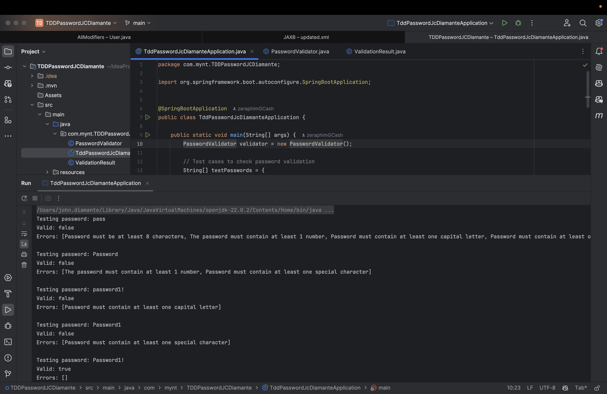
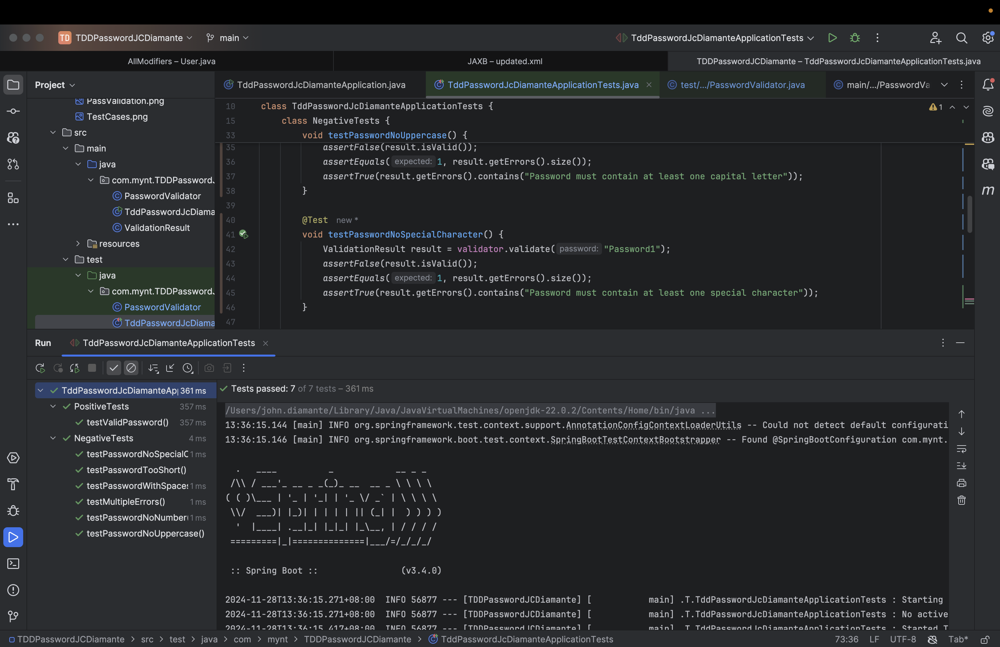

# TDDPassword

Instructions:
Create a class that serves as a password validator. The validation takes a string as an input and returns a validation result. The validation result should contain a boolean indicating if the password is valid or not, and also a list of the possible validation errors.

**Requirements**
1. The password must be at least & characters long. If it is not met, then the following error message should be returned: "Password must be at least 8 characters"
2. The password must contain at least 1 numeral. If it is not met, then the following error message should be returned: "The password must contain at least 1 number"
3. The validation function should handle multiple validation errors.
   For example, "somepassword" should an error message: "Password must be at least 8 characters, The password must contain at least 1 number"
4. The password must contain at least one uppercase letter. If it is not met, then the following error message should be returned: "password must contain at least one capital letter"
5. The password must contain at least one special character. If it is not met, then the following error message should be returned: "password must contain at least one special character"

`NOTE: Use TDD`

**Password Validation**

**Test Cases**
